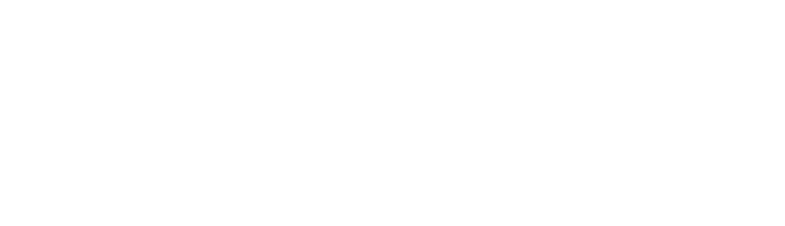
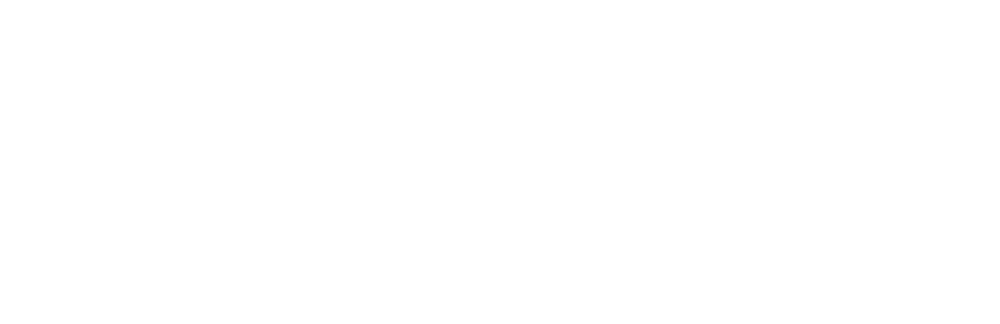

# Images
Preview and links for all image assets.

## Backgrounds

### Travel background 1


```text
https://awhitmana0.github.io/images/backgrounds/Travel%20background%201.png
```

### background


```text
https://awhitmana0.github.io/images/backgrounds/background.png
```

### gradient


```text
https://awhitmana0.github.io/images/backgrounds/gradient.png
```

## Demo Logos

### auth0dem0logo white


```text
https://awhitmana0.github.io/images/demo-logos/auth0dem0logo-white.svg
```

### auth0dem0logo


```text
https://awhitmana0.github.io/images/demo-logos/auth0dem0logo.png
```

### auth0dem0logo


```text
https://awhitmana0.github.io/images/demo-logos/auth0dem0logo.svg
```

### lock0 icon


```text
https://awhitmana0.github.io/images/demo-logos/lock0-icon.svg
```

### lock0 logo dark


```text
https://awhitmana0.github.io/images/demo-logos/lock0-logo-dark.svg
```

### lock0 logo


```text
https://awhitmana0.github.io/images/demo-logos/lock0-logo.svg
```

### lock0 wordmark


```text
https://awhitmana0.github.io/images/demo-logos/lock0-wordmark.svg
```

### logo


```text
https://awhitmana0.github.io/images/demo-logos/logo.svg
```

### org logo dark


```text
https://awhitmana0.github.io/images/demo-logos/org-logo-dark.svg
```

### org logo


```text
https://awhitmana0.github.io/images/demo-logos/org-logo.svg
```

### travel0 fulllogo white


```text
https://awhitmana0.github.io/images/demo-logos/travel0-fulllogo-white.svg
```

### travel0 fulllogo


```text
https://awhitmana0.github.io/images/demo-logos/travel0-fulllogo.svg
```

### travel0 squarelogo


```text
https://awhitmana0.github.io/images/demo-logos/travel0-squarelogo.svg
```

## Generic Icons

### apple original


```text
https://awhitmana0.github.io/images/generic-icons/apple-original.svg
```

### facebook plain


```text
https://awhitmana0.github.io/images/generic-icons/facebook-plain.svg
```

### github original


```text
https://awhitmana0.github.io/images/generic-icons/github-original.svg
```

### google original


```text
https://awhitmana0.github.io/images/generic-icons/google-original.svg
```

### key


```text
https://awhitmana0.github.io/images/generic-icons/key.svg
```

### passkey


```text
https://awhitmana0.github.io/images/generic-icons/passkey.svg
```

### windows11 original


```text
https://awhitmana0.github.io/images/generic-icons/windows11-original.svg
```

## Logo

### Auth0 Shield Lockup Black RGB


```text
https://awhitmana0.github.io/images/logo/Auth0_Shield%20Lockup_Black_RGB.svg
```

### Auth0 Shield Lockup White RGB


```text
https://awhitmana0.github.io/images/logo/Auth0_Shield%20Lockup_White_RGB.svg
```

### Auth0 Shield Logomark Black RGB


```text
https://awhitmana0.github.io/images/logo/Auth0_Shield%20Logomark_Black_RGB.svg
```

### Auth0 Shield Logomark White RGB


```text
https://awhitmana0.github.io/images/logo/Auth0_Shield%20Logomark_White_RGB.svg
```

### Okta Aura Lockup Black RGB


```text
https://awhitmana0.github.io/images/logo/Okta_Aura_Lockup_Black_RGB.svg
```

### Okta Aura Lockup White RGB


```text
https://awhitmana0.github.io/images/logo/Okta_Aura_Lockup_White_RGB.svg
```

### Okta Aura Logomark Black RGB


```text
https://awhitmana0.github.io/images/logo/Okta_Aura_Logomark_Black_RGB.svg
```

### Okta Aura Logomark White RGB


```text
https://awhitmana0.github.io/images/logo/Okta_Aura_Logomark_White_RGB.svg
```

