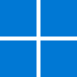

# Images
Preview and links for all image assets.

## Backgrounds

### Travel background 1
<table bgcolor="#f1f5f9" cellpadding="16" border="0"><tr><td>

</td></tr></table>

```text
https://awhitmana0.github.io/images/backgrounds/Travel%20background%201.png
```

### background
<table bgcolor="#f1f5f9" cellpadding="16" border="0"><tr><td>

</td></tr></table>

```text
https://awhitmana0.github.io/images/backgrounds/background.png
```

### gradient
<table bgcolor="#f1f5f9" cellpadding="16" border="0"><tr><td>

</td></tr></table>

```text
https://awhitmana0.github.io/images/backgrounds/gradient.png
```

## Demo Logos

### auth0dem0logo white
<table bgcolor="#f1f5f9" cellpadding="16" border="0"><tr><td>

</td></tr></table>

```text
https://awhitmana0.github.io/images/demo-logos/auth0dem0logo-white.svg
```

### auth0dem0logo
<table bgcolor="#f1f5f9" cellpadding="16" border="0"><tr><td>

</td></tr></table>

```text
https://awhitmana0.github.io/images/demo-logos/auth0dem0logo.png
```

### auth0dem0logo
<table bgcolor="#f1f5f9" cellpadding="16" border="0"><tr><td>

</td></tr></table>

```text
https://awhitmana0.github.io/images/demo-logos/auth0dem0logo.svg
```

### lock0 icon
<table bgcolor="#f1f5f9" cellpadding="16" border="0"><tr><td>

</td></tr></table>

```text
https://awhitmana0.github.io/images/demo-logos/lock0-icon.svg
```

### lock0 logo dark
<table bgcolor="#f1f5f9" cellpadding="16" border="0"><tr><td>

</td></tr></table>

```text
https://awhitmana0.github.io/images/demo-logos/lock0-logo-dark.svg
```

### lock0 logo
<table bgcolor="#f1f5f9" cellpadding="16" border="0"><tr><td>

</td></tr></table>

```text
https://awhitmana0.github.io/images/demo-logos/lock0-logo.svg
```

### lock0 wordmark
<table bgcolor="#f1f5f9" cellpadding="16" border="0"><tr><td>

</td></tr></table>

```text
https://awhitmana0.github.io/images/demo-logos/lock0-wordmark.svg
```

### logo
<table bgcolor="#f1f5f9" cellpadding="16" border="0"><tr><td>

</td></tr></table>

```text
https://awhitmana0.github.io/images/demo-logos/logo.svg
```

### org logo dark
<table bgcolor="#f1f5f9" cellpadding="16" border="0"><tr><td>

</td></tr></table>

```text
https://awhitmana0.github.io/images/demo-logos/org-logo-dark.svg
```

### org logo
<table bgcolor="#f1f5f9" cellpadding="16" border="0"><tr><td>

</td></tr></table>

```text
https://awhitmana0.github.io/images/demo-logos/org-logo.svg
```

### travel0 fulllogo white
<table bgcolor="#f1f5f9" cellpadding="16" border="0"><tr><td>

</td></tr></table>

```text
https://awhitmana0.github.io/images/demo-logos/travel0-fulllogo-white.svg
```

### travel0 fulllogo
<table bgcolor="#f1f5f9" cellpadding="16" border="0"><tr><td>

</td></tr></table>

```text
https://awhitmana0.github.io/images/demo-logos/travel0-fulllogo.svg
```

### travel0 squarelogo
<table bgcolor="#f1f5f9" cellpadding="16" border="0"><tr><td>

</td></tr></table>

```text
https://awhitmana0.github.io/images/demo-logos/travel0-squarelogo.svg
```

## Generic

### apple original
<table bgcolor="#f1f5f9" cellpadding="16" border="0"><tr><td>

</td></tr></table>

```text
https://awhitmana0.github.io/images/generic/apple-original.svg
```

### facebook plain
<table bgcolor="#f1f5f9" cellpadding="16" border="0"><tr><td>

</td></tr></table>

```text
https://awhitmana0.github.io/images/generic/facebook-plain.svg
```

### github original
<table bgcolor="#f1f5f9" cellpadding="16" border="0"><tr><td>

</td></tr></table>

```text
https://awhitmana0.github.io/images/generic/github-original.svg
```

### google original
<table bgcolor="#f1f5f9" cellpadding="16" border="0"><tr><td>

</td></tr></table>

```text
https://awhitmana0.github.io/images/generic/google-original.svg
```

### key
<table bgcolor="#f1f5f9" cellpadding="16" border="0"><tr><td>

</td></tr></table>

```text
https://awhitmana0.github.io/images/generic/key.svg
```

### passkey
<table bgcolor="#f1f5f9" cellpadding="16" border="0"><tr><td>

</td></tr></table>

```text
https://awhitmana0.github.io/images/generic/passkey.svg
```

### windows11 original
<table bgcolor="#f1f5f9" cellpadding="16" border="0"><tr><td>

</td></tr></table>

```text
https://awhitmana0.github.io/images/generic/windows11-original.svg
```

## Logo

### Auth0 Shield Lockup Black RGB
<table bgcolor="#f1f5f9" cellpadding="16" border="0"><tr><td>

</td></tr></table>

```text
https://awhitmana0.github.io/images/logo/Auth0_Shield%20Lockup_Black_RGB.svg
```

### Auth0 Shield Lockup White RGB
<table bgcolor="#f1f5f9" cellpadding="16" border="0"><tr><td>

</td></tr></table>

```text
https://awhitmana0.github.io/images/logo/Auth0_Shield%20Lockup_White_RGB.svg
```

### Auth0 Shield Logomark Black RGB
<table bgcolor="#f1f5f9" cellpadding="16" border="0"><tr><td>

</td></tr></table>

```text
https://awhitmana0.github.io/images/logo/Auth0_Shield%20Logomark_Black_RGB.svg
```

### Auth0 Shield Logomark White RGB
<table bgcolor="#f1f5f9" cellpadding="16" border="0"><tr><td>

</td></tr></table>

```text
https://awhitmana0.github.io/images/logo/Auth0_Shield%20Logomark_White_RGB.svg
```

### Okta Aura Lockup Black RGB
<table bgcolor="#f1f5f9" cellpadding="16" border="0"><tr><td>

</td></tr></table>

```text
https://awhitmana0.github.io/images/logo/Okta_Aura_Lockup_Black_RGB.svg
```

### Okta Aura Lockup White RGB
<table bgcolor="#f1f5f9" cellpadding="16" border="0"><tr><td>

</td></tr></table>

```text
https://awhitmana0.github.io/images/logo/Okta_Aura_Lockup_White_RGB.svg
```

### Okta Aura Logomark Black RGB
<table bgcolor="#f1f5f9" cellpadding="16" border="0"><tr><td>

</td></tr></table>

```text
https://awhitmana0.github.io/images/logo/Okta_Aura_Logomark_Black_RGB.svg
```

### Okta Aura Logomark White RGB
<table bgcolor="#f1f5f9" cellpadding="16" border="0"><tr><td>

</td></tr></table>

```text
https://awhitmana0.github.io/images/logo/Okta_Aura_Logomark_White_RGB.svg
```

