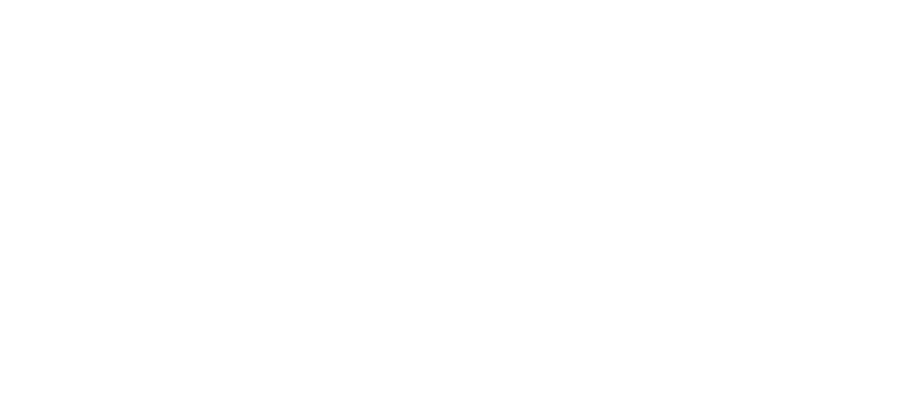
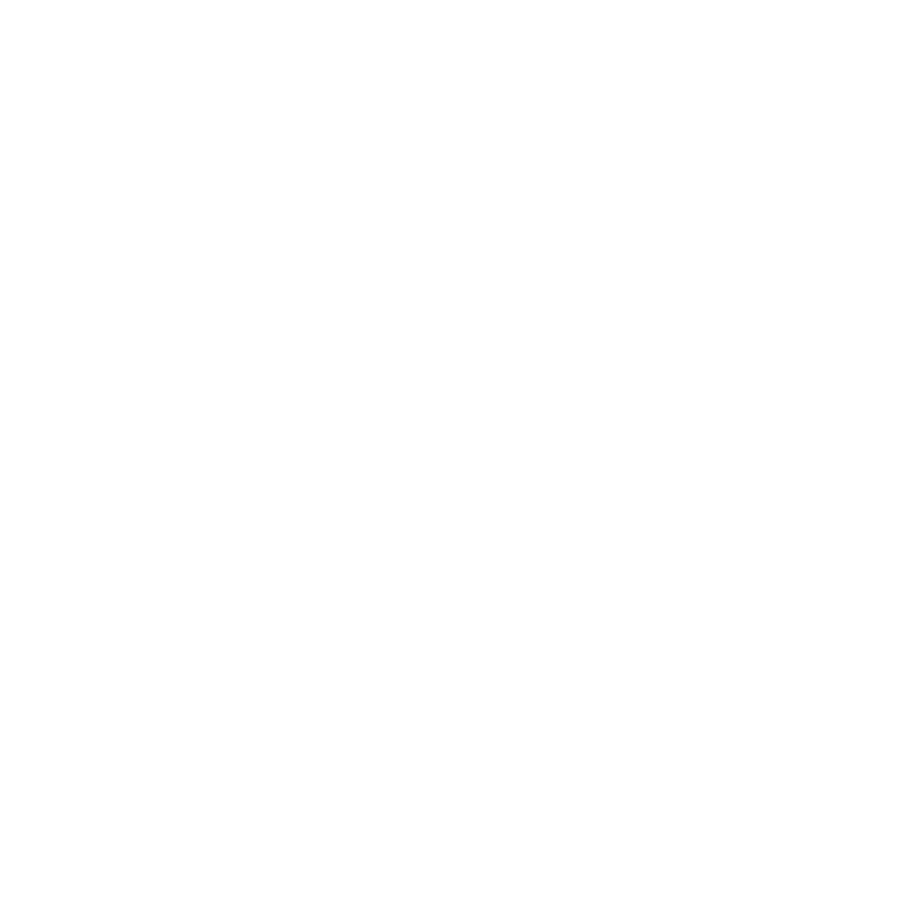

# Images
Preview and links for all image assets.

## Auth0 Shield Lockup Black RGB


```text
https://awhitmana0.github.io/images/Auth0_Shield%20Lockup_Black_RGB.svg
```

## Auth0 Shield Lockup White RGB


```text
https://awhitmana0.github.io/images/Auth0_Shield%20Lockup_White_RGB.svg
```

## Auth0 Shield Logomark Black RGB


```text
https://awhitmana0.github.io/images/Auth0_Shield%20Logomark_Black_RGB.svg
```

## Auth0 Shield Logomark White RGB


```text
https://awhitmana0.github.io/images/Auth0_Shield%20Logomark_White_RGB.svg
```

## Okta Aura Lockup Black RGB


```text
https://awhitmana0.github.io/images/Okta_Aura_Lockup_Black_RGB.svg
```

## Okta Aura Lockup White RGB


```text
https://awhitmana0.github.io/images/Okta_Aura_Lockup_White_RGB.svg
```

## Okta Aura Logomark Black RGB


```text
https://awhitmana0.github.io/images/Okta_Aura_Logomark_Black_RGB.svg
```

## Okta Aura Logomark White RGB


```text
https://awhitmana0.github.io/images/Okta_Aura_Logomark_White_RGB.svg
```

## Travel background 1


```text
https://awhitmana0.github.io/images/Travel%20background%201.png
```

## apple original


```text
https://awhitmana0.github.io/images/apple-original.svg
```

## auth0dem0logo white


```text
https://awhitmana0.github.io/images/auth0dem0logo-white.svg
```

## auth0dem0logo


```text
https://awhitmana0.github.io/images/auth0dem0logo.png
```

## auth0dem0logo


```text
https://awhitmana0.github.io/images/auth0dem0logo.svg
```

## background


```text
https://awhitmana0.github.io/images/background.png
```

## facebook plain


```text
https://awhitmana0.github.io/images/facebook-plain.svg
```

## github original


```text
https://awhitmana0.github.io/images/github-original.svg
```

## google original


```text
https://awhitmana0.github.io/images/google-original.svg
```

## gradient


```text
https://awhitmana0.github.io/images/gradient.png
```

## key


```text
https://awhitmana0.github.io/images/key.svg
```

## lock0 icon


```text
https://awhitmana0.github.io/images/lock0-icon.svg
```

## lock0 logo dark


```text
https://awhitmana0.github.io/images/lock0-logo-dark.svg
```

## lock0 logo


```text
https://awhitmana0.github.io/images/lock0-logo.svg
```

## lock0 wordmark


```text
https://awhitmana0.github.io/images/lock0-wordmark.svg
```

## logo


```text
https://awhitmana0.github.io/images/logo.svg
```

## org logo dark


```text
https://awhitmana0.github.io/images/org-logo-dark.svg
```

## org logo


```text
https://awhitmana0.github.io/images/org-logo.svg
```

## passkey


```text
https://awhitmana0.github.io/images/passkey.svg
```

## travel0 fulllogo white


```text
https://awhitmana0.github.io/images/travel0-fulllogo-white.svg
```

## travel0 fulllogo


```text
https://awhitmana0.github.io/images/travel0-fulllogo.svg
```

## travel0 squarelogo


```text
https://awhitmana0.github.io/images/travel0-squarelogo.svg
```

## windows11 original


```text
https://awhitmana0.github.io/images/windows11-original.svg
```

